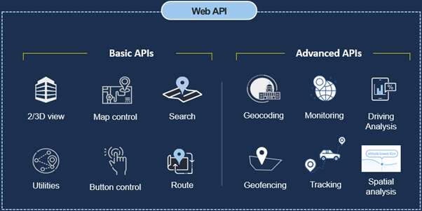

# FATOS API


  
  FATOS APIs are divided into Basic and Advanced and consist of a total of 32.

The procedure for using the FATOS Map API using JavaScript is as follows.

The implementation uses JavaScript code to display the map on the html page, which consists of the following steps.

First, load the Maps API code libraries.  
Second, initialize a map object, displaying the map.

