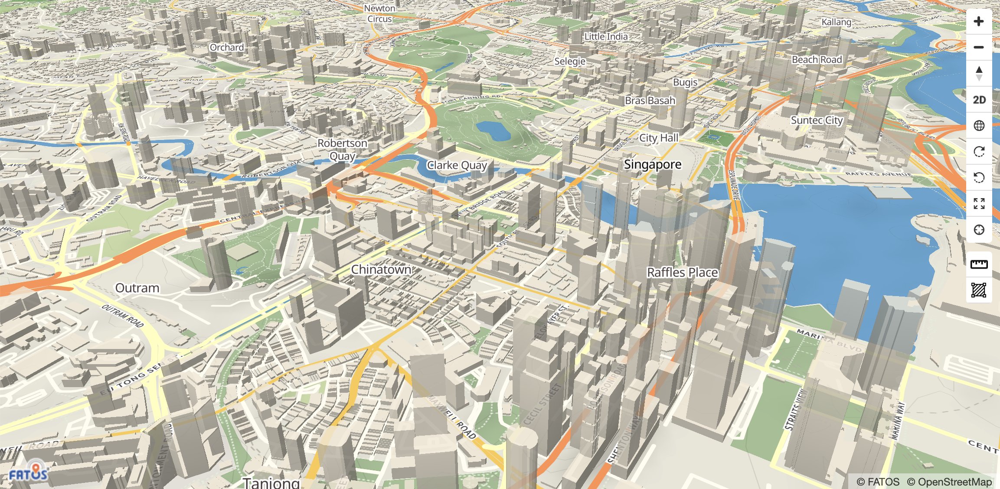

# Map

### Introduction

**FATOS map is a JavaScript library that uses WebGL to rendering maps while interacting with users in a vector tile type.**



### Description

The map object represents a map of the screen. It provides methods and properties for programmatically changing the map and generating an event when an user interacts with it. Map instance creates a map by specifying containers and other options

| Name | Description | Optional |
| :--- | :--- | :--- |
| `zoom` | The zoom value is the zoom in/out value of the map. Not the required input. | `option` |
| `center` | Center is coordinate value that will be displayed to the center at the first loading of the map and is a required input. | `must` |
| `maxZoom` | Maximum zoom value. Not required value. | `option` |
| `minZoom` | Minimum zoom value. Not required value. | `option` |
| `key` | Authentication value for map use. Required input value. | `must` |
| `zoomControl` | The value of the button to adjust the zoom level value of the map. Not required value. | `option` |
| `draggable` | Whether the marker on the map can be moved to the desired location. Not required value. | `option` |
| `rotateControl` | This option lets you interact with the rotation of the map by dragging it. Not required value. | `option` |
| `tilt` | The slope of the map. The range from 0 to 60 and the initial value is zero\(0\). | `option` |

### Example

```markup
<!DOCTYPE html>
<html lang="en">
<head>
    <meta charset="utf-8">
    <title>FATOS Map</title>
</head>
<body>
<div style="height: 100vh;">
    <div id="app"></div>

</div>
<script type="text/javascript" src="https://maps.fatos.biz/dist/fatosmap-gl.js"></script>
<script>
    let LatLng = {lat: 1.28516, lng: 103.84738}
    let map = new fatosmap.maps.Map(
        document.getElementById("app"),
        {
            zoom: 14,
            center: LatLng,
            maxZoom: 20,
            minZoom: 2,
            scrollwheel: true,
            scaleControl: true,
            fullscreenControl: true,
            zoomControl: false,
            draggable: true,
            rotateControl: true,
            key: 'YOUR_API_KEY'
        }
    )
</script>
</body>
</html>
```

