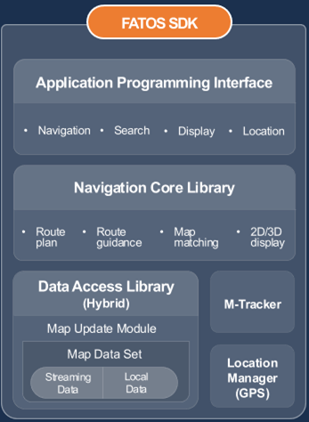

# FATOS SDK

FATOS SDK\(Software Development Toolkit\) makes it easy for 3rd party developers to develop their own services. It supports IOS, Android and React Native.

You can give users advanced mobility services that support their business which is map display, location services, in-car navigation, and more.

SDK configuration diagram

\[Interface Class\]

You can use ‘Navigation’, ‘Search’, ‘Display’ and ‘Location’ function.

\[Navigation Core Library\]

You can use ‘RP’, ‘RG’, ‘MM’ and ‘2D/3D display’ function.

\[Data access Library \(Hybrid\)\]

You can use most of functions either on/off environment.

