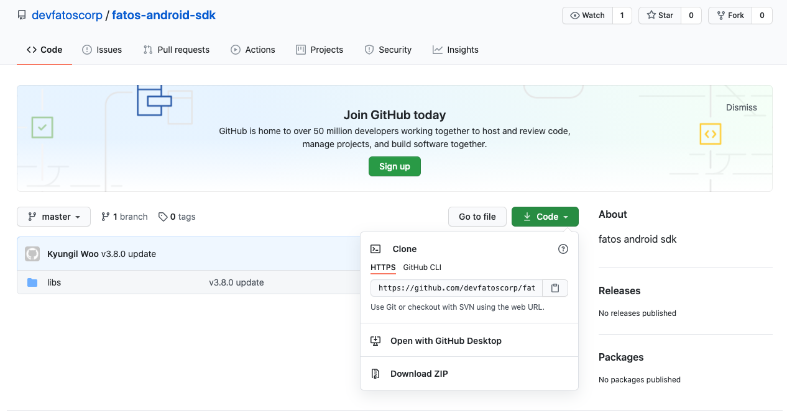

# Start

In this section, a guide to set up development environment for FATOS SDK for Android will be introduced. The functions of the SDK are largely composed of map, search, and route planning related operations. The map function can control the map layers, settings, and operation. To use "FATOS SDK for Android", you must request an SDK key and then apply that key to the source. If you want an SDK key, please go to [https://console.fatos.biz](http://console.fatos.biz/) and request an SDK key after sign up.

Please let us know if you have any technical problems using our SDK   
Contact : [sales@fatoscorp.com](mailto:sales@fatoscorp.com)


**If you are a OneMap user, kindly request to** [**https://onemap-console.fatos.biz**](http://onemap-console.fatos.biz/)


### Development Environment

Clone or download FATOS SDK for Android from [https://github.com/devfatoscorp/fatos-android-sdk](https://github.com/devfatoscorp/fatos-android-sdk)



FATOS SDK for Android is deployed as a form of AAR \(Android Archive Package\). Therefore, it must be linked within your project.


Make sure to check the compatibility

FATOS SDK for Android supports Android 5.0 or above \(API Level 20 or above\)


#### To link AAR file

modify **app/build.gradle** like as follow:

```java
repositories {
    flatDir {
        dirs 'libs'
    }
}
dependencies {
    implementation fileTree(dir: 'libs', include: ['*.jar'])
    implementation(name:'fire_sdk_vX.X.X', ext:'aar')

....
```

#### Permissions

To use FATOS SDK for Android, you must set 3 permission settings

```java
@Override
protected void onCreate(Bundle savedInstanceState) {
    super.onCreate(savedInstanceState);

    if (Build.VERSION.SDK_INT >= Build.VERSION_CODES.M) {
        int permissionResultWRITE_EXTERNAL_STORAGE = checkSelfPermission(Manifest.permission.WRITE_EXTERNAL_STORAGE);
        int permissionResultACCESS_FINE_LOCATION = checkSelfPermission(Manifest.permission.ACCESS_FINE_LOCATION);
        int permissionResultACCESS_READ_PHONE= checkSelfPermission(Manifest.permission.READ_PHONE_STATE);

        if (permissionResultWRITE_EXTERNAL_STORAGE == PackageManager.PERMISSION_DENIED
                || permissionResultACCESS_FINE_LOCATION == PackageManager.PERMISSION_DENIED
                || permissionResultACCESS_READ_PHONE == PackageManager.PERMISSION_DENIED) {
            requestPermissions(new String[]{Manifest.permission.WRITE_EXTERNAL_STORAGE, Manifest.permission.ACCESS_FINE_LOCATION, Manifest.permission.READ_PHONE_STATE}, 1000);
        }
        else {
            m_Handler.postDelayed(startMainActivity, 10);
            getWindow().setFlags(WindowManager.LayoutParams.FLAG_FULLSCREEN,
                WindowManager.LayoutParams.FLAG_FULLSCREEN);
        }
    }
    else {
        m_Handler.postDelayed(startMainActivity, 10);
        getWindow().setFlags(WindowManager.LayoutParams.FLAG_FULLSCREEN,
            WindowManager.LayoutParams.FLAG_FULLSCREEN);
    }
}

```

For a flexible navigation feature to be used in your project, your "Application class" and "MainActivity" must be inherited from "ANaviApplication class" and "FMBaseActivity class" respectively.

```java
@Override
public class TNaviApplication extends ANaviApplication {
    private Context m_Context;
    @Override
    public void onCreate() {
    ...
    }
}
    

public class TNaviMainActivity extends FMBaseActivity {
...
}
```

FATOS SDK for Android requires that Navi Engine initialize. We strongly recommend you do so at onCreate\(\) of MainActivity that extends FMBaseActivity.

```java
public class TNaviMainActivity extends FMBaseActivity {
    private void InitProcess() throws IOException {
        m_Context = this;
        m_gApp = (ANaviApplication) m_Context.getApplicationContext();
        m_route = m_gApp.getRouteApiInstance();
        FMInterface.CreateInstance(m_Context);
        m_FMInterface = FMInterface.GetInstance();
        m_iEngineInit = initFatosNaviEngine();

        if(m_iEngineInit != 1)
        {
            Intent intent = new Intent();
            intent.setAction(TNaviActionCode.READY_MAIN_MAP); // Action name
            sendBroadcast(intent);
            return;
        }
    }
}
```

#### To add API key

You must set your API key through FMInterface.initKey\(\) function at onCreate\(\) method in your Application class.

```java
public class TNaviApplication extends ANaviApplication {
    private Context m_Context;
    
    @Override
    public void onCreate() {
        m_Context = this;
        FMInterface.initKey(m_Context, "FATOS SDK API key");
        super.onCreate();
        ...
        ...

```

If you haven't got an API key, please visit:



