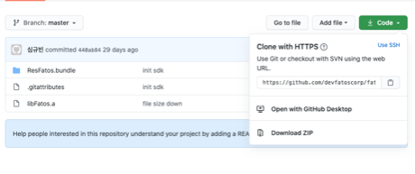

# Start

In this section, a guide to set up development environment for FATOS SDK for iOS will be introduced. The functions of the SDK are largely composed of map, search, and route planning related operations. The map function can control the map layers, settings, and operation. To use "FATOS SDK for iOS", you must request an SDK key and then apply that key to the source. If you want an SDK key, please go to [https://console.fatos.biz](http://console.fatos.biz/) and request an SDK key after sign up.

Please let us know if you have any technical problems using our SDK   
Contact : [dev@fatoscorp.com](mailto:dev@fatoscorp.com)


**If you are a OneMap user, kindly request to** [**https://onemap-console.fatos.biz**](http://onemap-console.fatos.biz/)


### Development Environment

Clone or download FATOS SDK for iOS from [https://github.com/devfatoscorp/fatos-ios-sdk](https://github.com/devfatoscorp/fatos-ios-sdk)

To use FATOS SDK for iOS, you must add following folders and files to your project.

* include \(static library header\) \(folder\)
* libFatos.a \(static library\) \(file\)
* ResFatos.bundle \(SDK resources\) \(file\)


Make sure to check the compatibility

FATOS SDK for iOS supports Xcode 11 or higher

FATOS SDK for iOS supports iOS 13 or higher

FATOS SDK for iOS supports iOS hardware \(Not simulators\)


### To add libFatos.a and basic framework

Click to "project explorer" -&gt; click **TARGETS** -&gt; **Build Phases** -&gt; add a FATOS SDK for iOS and framework needed to link binary with the library. Then, add the following items.

* libFatos.a \(FATOS SDK for iOS\)
* GLKit.framework
* OpenGLES.framework
* CoreLocation.framework
* AVFoundation.framework
* AudioToolbox.framework

### To add ResFatos.bundle \(SDK resources\)

Click "project explorer" -&gt; click **TARGETS** -&gt; **Build Phases** -&gt; add ResFatos.bundle to copy Bundle Resources

### To link "include" folder \(static library header\)

Click "project explorer" -&gt; click **TARGETS** -&gt; click **Build Settings** -&gt; **Search Paths** -&gt; Set "**include**" folder path to "**Header Search Paths**"

### To add SDK key

Go to "Project" -&gt; "info.plist" and add "sdk\_key"

If you haven't got a SDK key, please visit:



