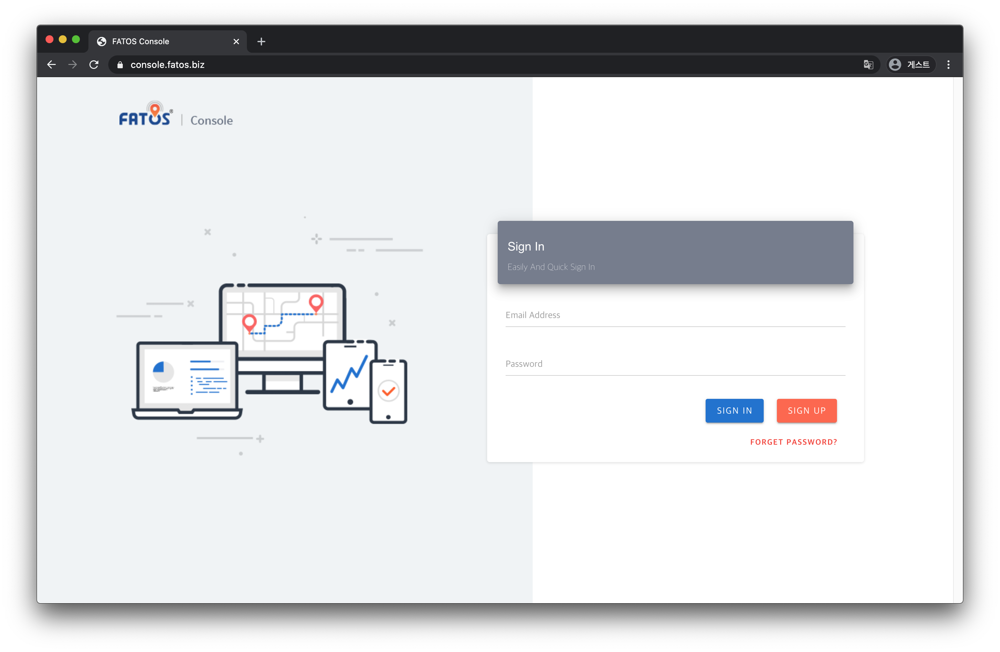

# Get your API Key

### How Do I Get an API Key?

Although we provide intuitive API functions and services, they are not available if you do not have an API Key. In order to get an account, please visit our console website [https://console.fatos.biz/](https://console.fatos.biz/)

Getting an API key is just as easy as signing up for an account.

1. Sign up for a FATOS account at https://console.fatos.biz
2. Verify your email \(We send a verification mail\)
3. Sign-in, you will get a free plan API key. \(You can request a non-free API key for advanced features\)

If you do not have a console account, hit the **sign up** button and get one!

After you sign up with your information, a verification mail will be sent to the email you used to sign up.


API key may  not be available if you do not verify your email.


If you do have one, simply sign in and you will see your API Key at the top right corner of the page.

Voilà! You have got an API key. With the key you have obtained, you can finally make use of any of FATOS SDK! Congratulation.

